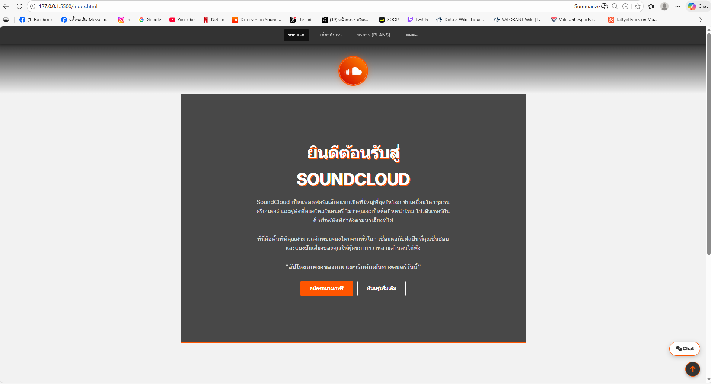
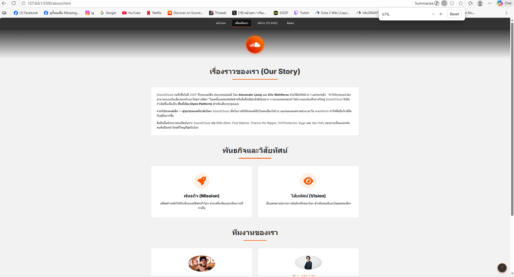
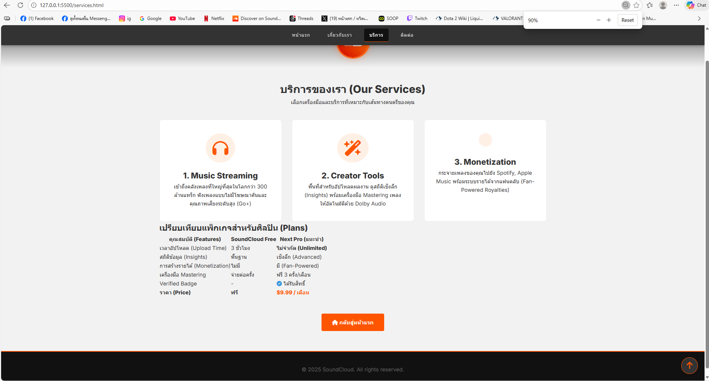
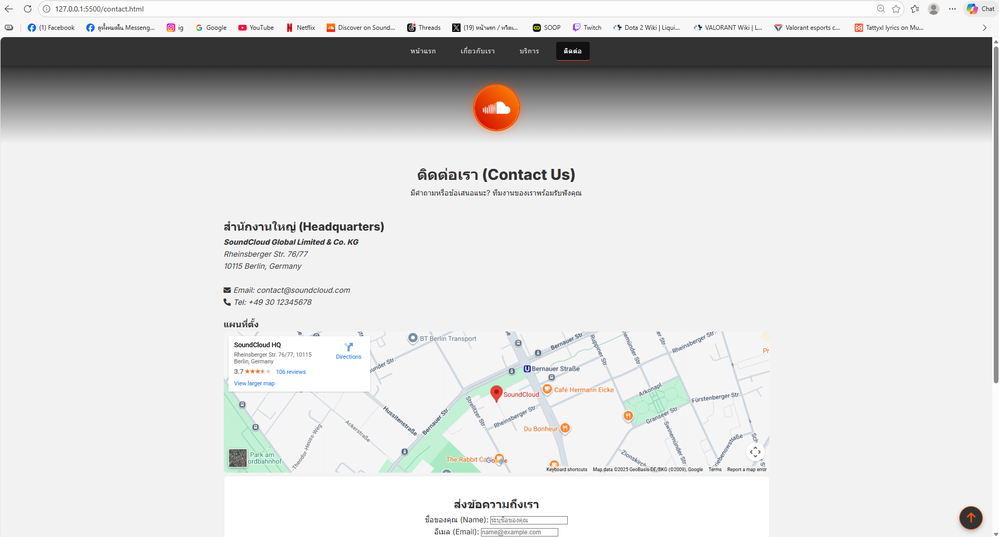

# SoundCloud Replica Website ☁️🎵

เว็บไซต์จำลองของ **SoundCloud** แพลตฟอร์มสตรีมเพลงและเสียงที่ใหญ่ที่สุดในโลก โปรเจกต์นี้จัดทำขึ้นเพื่อฝึกทักษะการพัฒนาเว็บไซต์ด้วย **HTML5** และ **CSS3**

## 📂 ข้อมูล Assignment #1 & #2

เว็บไซต์นี้เป็นส่วนหนึ่งของวิชาการพัฒนาเว็บเบื้องต้น โดยจำลองโครงสร้างเว็บไซต์ธุรกิจประกอบด้วย 4 หน้าหลัก ได้แก่ หน้าแรก, เกี่ยวกับเรา, บริการ, และติดต่อเรา โดยมีการนำ **CSS Fundamentals** มาประยุกต์ใช้เพื่อความสวยงามตามข้อกำหนด

## 📁 โครงสร้างไฟล์ (File Structure)

- ```text
  soundcloud-replica/
  ├── index.html          # หน้าแรก (Home)
  ├── about.html          # หน้าเกี่ยวกับเรา (About Us)
  ├── services.html       # หน้าบริการ (Services & Plans)
  ├── contact.html        # หน้าติดต่อเรา (Contact)
  ├── css/
  │   └── styles.css      # ไฟล์ CSS หลัก (Theme: Music/Dark/Orange)
  ├── images/             # โฟลเดอร์เก็บรูปภาพประกอบ
  │   ├── logo.png
  │   ├── hero-bg.jpg
  │   ├── Ljung.jpg
  │   ├── Eric.jpg
  │   └── sarah.jpg
  ├── screenshots/        # โฟลเดอร์เก็บรูปภาพหน้าจอ
  │   ├── home.png
  │   ├── about.png
  │   ├── services.png
  │   └── contact.png
  └── README.md           # เอกสารประกอบโปรเจกต์
  ```

1. Reset & Typography:
   o รีเซ็ตค่าเริ่มต้น margin, padding, box-sizing เพื่อการจัดวางที่แม่นยำ
   o เลือกใช้ฟอนต์ 'Inter' และ 'Roboto' เพื่อความทันสมัยเหมือนแอปพลิเคชันจริง
   o กำหนดธีมสีหลักเป็น SoundCloud Orange (#ff5500), Dark Grey (#333) และ White
2. Navigation Bar (Sticky & Flexbox):
   o ใช้ position: sticky ให้เมนูติดด้านบนตลอดเวลาเมื่อเลื่อนหน้าจอ
   o จัดวางเมนูด้วย Flexbox ให้ดูสะอาดตา
   o เพิ่ม Hover Effect ขีดเส้นใต้สีส้มเมื่อชี้ที่เมนู
3. Hero Section (Gradient & Background):
   o สร้างส่วนต้อนรับขนาดใหญ่ (70vh) พร้อมภาพพื้นหลังที่ซ้อนทับด้วย linear-gradient สีดำจางๆ เพื่อให้อ่านข้อความง่าย
   o ตกแต่งหัวข้อด้วยเงา (Text Shadow) และปุ่มกดสไตล์ Modern
4. Services & Team (CSS Grid Layout):
   o ใช้ CSS Grid จัดวางการ์ดบริการและรูปทีมงานแบบอัตโนมัติ (repeat(auto-fit, minmax(...)))
   o การ์ดมีลูกเล่น Hover Animation (เด้งขึ้นและมีเงา) เพื่อความน่าสนใจ
   o ตกแต่งรูปทีมงานเป็นวงกลมพร้อมขอบสีขาวดูโดดเด่น
5. Pricing Table (Responsive):
   o ปรับแต่งตารางแพ็กเกจให้สวยงามด้วยการสลับสีบรรทัด (Zebra Striping)
   o เพิ่ม overflow-x: auto เพื่อให้ตารางเลื่อนได้ในมือถือ (Responsive Table)
6. Contact Form Styling:
   o จัดฟอร์มให้อยู่กึ่งกลางและใส่กรอบเงา (Card Style)
   o ปรับช่อง input และ textarea ให้กว้างเต็มพื้นที่และมีระยะห่างที่เหมาะสม
7. Advanced Components:
   o Back to Top Button: ปุ่มลอยตัว (position: fixed) ที่มุมขวาล่าง
   o Logo Animation: โลโก้หมุนได้เมื่อเอาเมาส์ไปชี้ (Rotate Transform)

### 1. หน้าแรก (Home)

[คลิกเพื่อดูหน้าแรก](./index.html)

[](./index.html)

### 2. หน้าเกี่ยวกับเรา (About)

[คลิกเพื่อดูเกี่ยวกับ](./about.html)

[](./about.html)

### 3. หน้าบริการ (Services)

[คลิกเพื่อดูบริการ](./services.html)

[](./services.html)

### 4. หน้าติดต่อ (Contact)

[คลิกเพื่อดูติดต่อ](./contact.html)

[](./contact.html)
