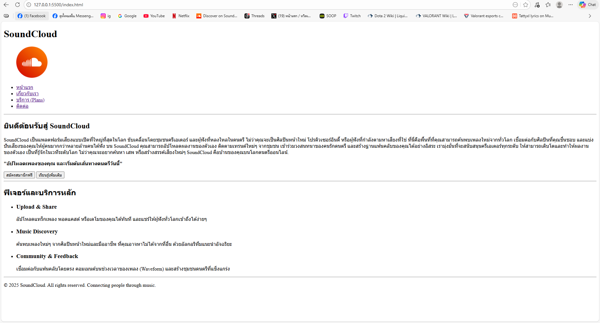
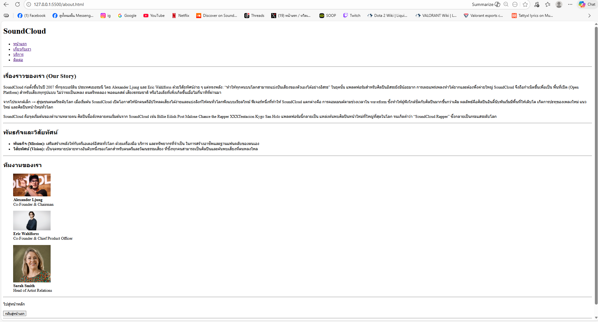
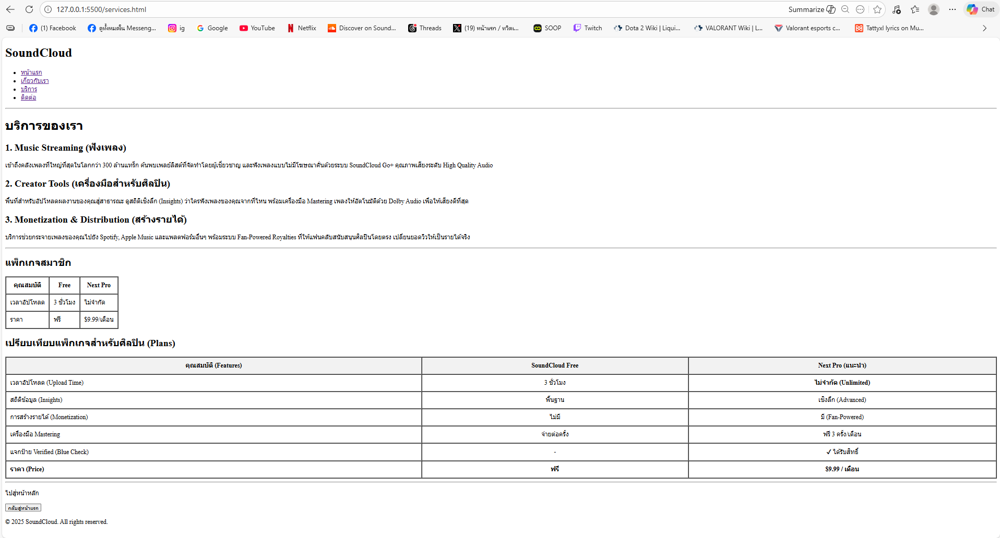
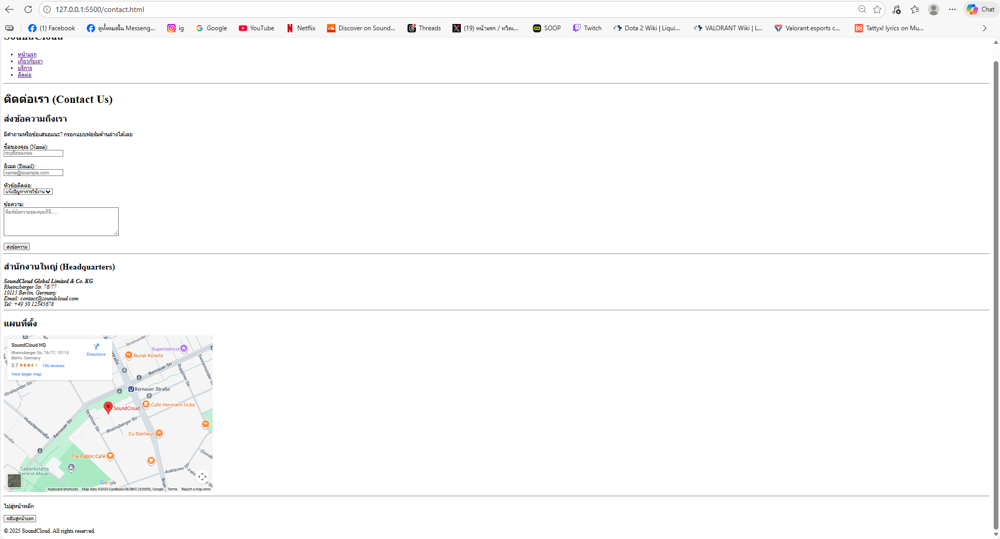

# Create a SoundCloud Replica Website

## Project description

- นี่คือการจำลองหน้าเว็บไซต์ของ SoundCloud เพื่อใช้เป็นโปรเจกต์ฝึกทักษะ (Assignment #1)
- สร้างขึ้นเพื่อเรียนรู้วิธีการเขียนหน้าเว็บด้วย HTML5 (Semantic Elements)
- เพื่อฝึกการแบ่งโครงสร้างหน้าเว็บ เช่น หน้าแรก เกี่ยวกับ บริการ ติดต่อ
- ไม่มีการใช้ CSS และ JavaScript (HTML ล้วน) ตามข้อกำหนด
- เนื้อหา ข้อมูลบริษัท และแผนที่ เป็นข้อมูลจำลองเพื่อการศึกษา

## File structure

- ```text
  my-business-web/
  ├── index.html          # หน้าแรก
  ├── about.html          # หน้าเกี่ยวกับเรา
  ├── services.html       # หน้าบริการ
  ├── contact.html        # หน้าติดต่อเรา
  ├── images/             # โฟลเดอร์เก็บรูปภาพ
  │   ├── logo.png
  │   ├── screenshot-index.png
  │   ├── screenshot-about.png
  │   ├── screenshot-services.png
  │   └── screenshot-contact.png
  └── README.md
  ```

- **index.html** – หน้าแรกของเว็บไซต์ มี Hero section และ Featured Services (Upload, Discovery, Community)
- **about.html** – หน้าเกี่ยวกับบริษัท มีประวัติความเป็นมา วิสัยทัศน์ พันธกิจ และทีมงาน
- **services.html** – หน้าบริการ แสดงรายละเอียดบริการของ SoundCloud และตารางเปรียบเทียบแพ็กเกจ (Table)
- **contact.html** – หน้าติดต่อ มี Contact Form (พร้อม Validation), ที่อยู่บริษัท และ Google Maps (Embed)
- **images/** – โฟลเดอร์สำหรับเก็บภาพโลโก้ รูปทีมงาน และภาพหน้าจอ
- **README.md** – เอกสารสำหรับอธิบายรายละเอียดของโปรเจกต์

## All screenshots and links to each page

### 1. หน้าแรก (Home)

[คลิกเพื่อดูหน้าแรก](./index.html)

[](./index.html)

### 2. หน้าเกี่ยวกับเรา (About)

[คลิกเพื่อดูเกี่ยวกับ](./about.html)

[](./about.html)

### 3. หน้าบริการ (Services)

[คลิกเพื่อดูบริการ](./services.html)

[](./services.html)

### 4. หน้าติดต่อ (Contact)

[คลิกเพื่อดูติดต่อ](./contact.html)

[](./contact.html)
